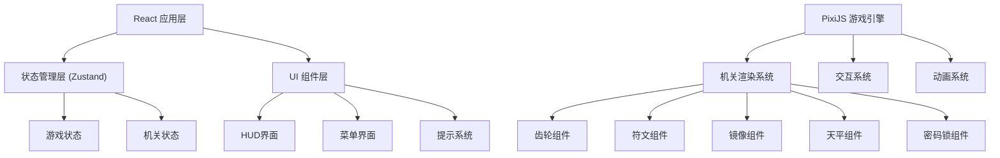

## 1. 架构设计



## 2. 技术选型

- **前端框架**: React@18 + TypeScript
- **游戏引擎**: PixiJS@7.4.0
- **状态管理**: Zustand@5.0.3
- **样式**: TailwindCSS@3.4.17
- **构建工具**: Vite@6.3.5
- **路由**: React Router DOM@7.3.0
- **图标**: Lucide React@0.511.0

## 3. 目录结构

```
src/
├── components/
│   ├── game/
│   │   ├── GameCanvas.tsx          # PixiJS 画布容器
│   │   ├── GearRoom.tsx            # 齿轮房间
│   │   ├── RuneRoom.tsx            # 符文房间
│   │   ├── MirrorRoom.tsx          # 镜像房间
│   │   ├── BalanceRoom.tsx         # 天平房间
│   │   └── LockRoom.tsx            # 密码房间
│   ├── ui/
│   │   ├── HUD.tsx                 # 顶部 HUD (计时器、令牌)
│   │   ├── HintModal.tsx           # 提示弹窗
│   │   ├── DarkOverlay.tsx         # 变暗惩罚遮罩
│   │   └── Button.tsx              # 通用按钮
│   └── layout/
│       ├── MainMenu.tsx            # 主菜单
│       ├── GameResult.tsx          # 结算界面
│       └── RoomTransition.tsx      # 房间过渡
├── engine/
│   ├── PixiGame.ts                 # PixiJS 游戏核心
│   ├── entities/
│   │   ├── Gear.ts                 # 齿轮实体
│   │   ├── Rune.ts                 # 符文实体
│   │   ├── Mirror.ts               # 镜子实体
│   │   ├── Laser.ts                # 激光实体
│   │   ├── Stone.ts                # 石块实体
│   │   └── Balance.ts              # 天平实体
│   └── systems/
│       ├── InteractionSystem.ts    # 交互系统
│       ├── AnimationSystem.ts      # 动画系统
│       └── PuzzleSystem.ts         # 谜题检测系统
├── store/
│   └── useGameStore.ts             # 游戏状态管理
├── types/
│   └── game.ts                     # 类型定义
├── utils/
│   ├── geometry.ts                 # 几何计算工具
│   └── constants.ts                # 游戏常量
├── pages/
│   ├── Home.tsx                    # 主页
│   └── Game.tsx                    # 游戏页
└── data/
    ├── puzzles.ts                  # 谜题配置数据
    └── hints.ts                    # 提示文本数据
```

## 4. 路由定义

| 路由 | 用途 |
|------|------|
| / | 主菜单页面 |
| /game | 游戏主页面 (包含五个房间) |
| /result | 结算页面 |

## 5. 状态管理

### 5.1 游戏状态

```typescript
interface GameState {
  currentRoom: number;           // 当前房间 0-4
  tokens: number;                // 墨家令牌数量
  startTime: number | null;      // 开始时间
  elapsedTime: number;           // 已用时间(秒)
  isPaused: boolean;             // 是否暂停
  isDarkened: boolean;           // 是否变暗惩罚
  darkenedTime: number;          // 变暗剩余时间
  clues: string[];               // 收集的线索
  completedRooms: boolean[];     // 已完成的房间
  showHint: boolean;             // 是否显示提示
  currentHint: string | null;    // 当前提示
}
```

### 5.2 机关状态

```typescript
interface GearState {
  placedGears: PlacedGear[];
  powerConnected: boolean;
}

interface RuneState {
  correctSequence: number[];
  currentSequence: number[];
  litRunes: boolean[];
}

interface MirrorState {
  mirrors: MirrorData[];
  laserPath: Point[];
  targetHit: boolean;
}

interface BalanceState {
  leftStones: Stone[];
  rightStones: Stone[];
  isBalanced: boolean;
}

interface LockState {
  input: string;
  correctCode: string;
}
```

## 6. 核心算法

### 6.1 齿轮传动检测
- 检测齿轮之间的啮合关系（中心距离等于两齿轮半径之和）
- BFS 遍历从动力源到出口的连通路径
- 检测齿轮旋转方向一致性

### 6.2 符文序列验证
- 预设正确的 12 步序列（如天干地支顺序）
- 每步点击与正确序列对比
- 错误则重置并触发惩罚

### 6.3 激光反射计算
- 射线追踪算法计算激光路径
- 反射角等于入射角
- 检测激光是否击中目标点

### 6.4 天平平衡检测
- 力矩计算：重量 × 力臂长度
- 左右力矩差小于阈值即为平衡
- 误差允许范围：±5%

### 6.5 密码锁推理
- 密码由前四关的线索组合而成
- 每关完成后获得一位数字线索
- 最终密码为四位数

## 7. 性能优化

- PixiJS 对象池管理，减少内存分配
- 机关部件按需渲染，隐藏房间不渲染
- 激光路径计算使用节流优化
- 使用 requestAnimationFrame 同步动画
- 状态变更最小化，避免不必要的重渲染
