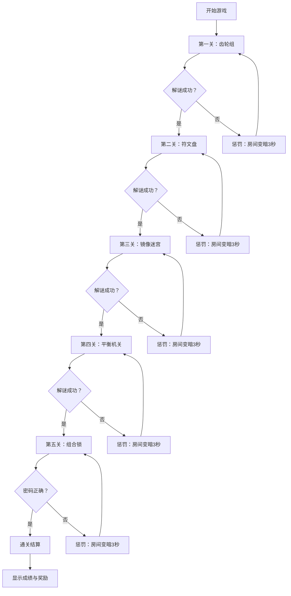

## 1. 产品概述

《墨家密室》是一款古风解谜冒险游戏，玩家扮演墨家新进弟子，为寻找失传的机关绝学闯入墨家总院后山密室。游戏通过五个精心设计的机关房间，融合了齿轮传动、符文序列、镜像反射、天平平衡、密码推理等多种解谜玩法。

- **核心玩法**：鼠标点击交互解谜，通过调整机关部件破解谜题
- **目标用户**：喜爱解谜游戏玩家，对中国古代墨家文化感兴趣的玩家
- **市场价值**：将中国古代墨家文化与解谜游戏结合，独特的文化体验

## 2. 核心特性

### 2.1 用户角色

| 角色 | 注册方式 | 核心权限 |
|------|----------|----------|
| 玩家 | 无需注册 | 游戏通关 |

### 2.2 功能模块

1. **主界面**：游戏开始、继续游戏、游戏说明
2. **齿轮房间**：齿轮组谜题，调整齿轮位置和大小传递动力
3. **符文房间**：符文盘谜题，按正确顺序点亮十二个符文
4. **镜像房间**：镜像迷宫谜题，反射激光击中目标
5. **天平房间**：平衡机关谜题，放置石块保持天平水平
6. **密码房间**：组合锁谜题，根据线索推出正确密码
7. **结算界面**：通关时间、令牌数量、评分系统

### 2.3 页面详情

| 页面名称 | 模块名称 | 功能描述 |
|----------|----------|----------|
| 主界面 | 开始游戏 | 进入第一个房间，初始化游戏状态 |
| 主界面 | 游戏说明 | 展示游戏玩法和规则介绍 |
| 齿轮房间 | 齿轮交互 | 点击齿轮放置/移除齿轮，调整大小 |
| 齿轮房间 | 动力检测 | 检测动力是否传递到出口 |
| 符文房间 | 符文点击 | 按顺序点击符文点亮 |
| 符文房间 | 顺序验证 | 验证点击顺序是否正确 |
| 镜像房间 | 镜子旋转 | 点击镜子旋转角度 |
| 镜像房间 | 激光追踪 | 实时计算激光路径 |
| 天平房间 | 石块放置 | 拖拽石块到天平两端 |
| 天平房间 | 平衡检测 | 检测天平是否平衡 |
| 密码房间 | 密码输入 | 点击数字输入密码 |
| 密码房间 | 线索展示 | 展示前四关收集的线索 |
| 通用UI | 令牌系统 | 显示剩余令牌，消耗令牌查看提示 |
| 通用UI | 计时器 | 记录通关时间 |
| 通用UI | 提示系统 | 点击提示按钮显示解谜提示 |
| 结算界面 | 成绩展示 | 显示通关时间、剩余令牌、奖励计算 |

## 3. 核心流程

## 4. 界面设计

### 4.1 设计风格

- **主色调**：深褐色 (#1a1410)、暗金色 (#8b7355)、古铜色 (#cd7f32)
- **辅助色**：墨绿 (#2d4a3e)、暗红 (#5c2b2b)
- **按钮风格**：仿古铜质感，圆角微立体，悬停发光效果
- **字体**：标题使用书法风格字体，正文使用古朴宋体/楷体
- **布局**：居中画布式布局，机关在中心，UI环绕四周
- **视觉风格**：2D 手绘风格，古旧纸张纹理背景，营造古密室神秘感

### 4.2 页面设计概览

| 页面名称 | 模块名称 | UI 元素 |
|----------|----------|----------|
| 主界面 | 标题区 | 游戏标题、副标题、背景装饰纹样 |
| 主界面 | 按钮区 | 开始游戏、游戏说明按钮 |
| 游戏房间 | 机关区 | PixiJS 画布渲染机关 |
| 游戏房间 | UI区 | 顶部计时器、令牌数、房间名称 |
| 游戏房间 | 交互区 | 机关部件高亮、提示按钮、返回按钮 |
| 结算界面 | 成绩区 | 通关时间、剩余令牌、奖励令牌数 |
| 结算界面 | 操作区 | 重新开始、返回主界面 |

### 4.3 响应式

- 桌面端优先，画布固定 1024x768
- 自适应缩放，保持比例居中显示
- 触摸交互与鼠标交互兼容

### 4.4 视觉特效

- **环境氛围**：暗色调，柔和的暖光照明效果
- **光影**：动态光影，机关激活时光线变化
- **动画**：机关运转动画、成功时的金色光效、错误时的暗红色闪
- **过渡**：房间切换淡入淡出动画
- **纹理**：古旧纸张纹理、木纹纹理、金属纹理叠加
